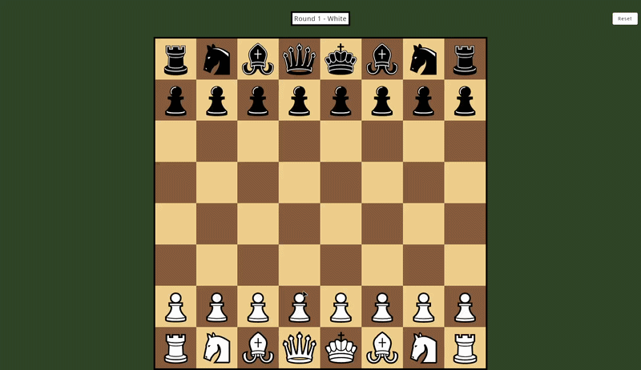

## Kotlin chess

A simple chess application written in Kotlin, to learn Kotlin.

Setup should just work with IntelliJ IDEA, in theory. Alternatively, build and run it manually with Gradle: `./gradlew build`, `./gradlew run`.

The project is done, but here's a wishlist of fancy features that could potentially be added:

* [ ] Improve the UI and make it into an actual app with a menu and such.
* [ ] Improve the UI around displaying whose turn it currently is.
* [ ] Support all stalemate conditions (e.g. 50 moves with no game progress).
* [ ] Drag and drop pieces?
* [ ] Add a mode where you can play against Stockfish.
